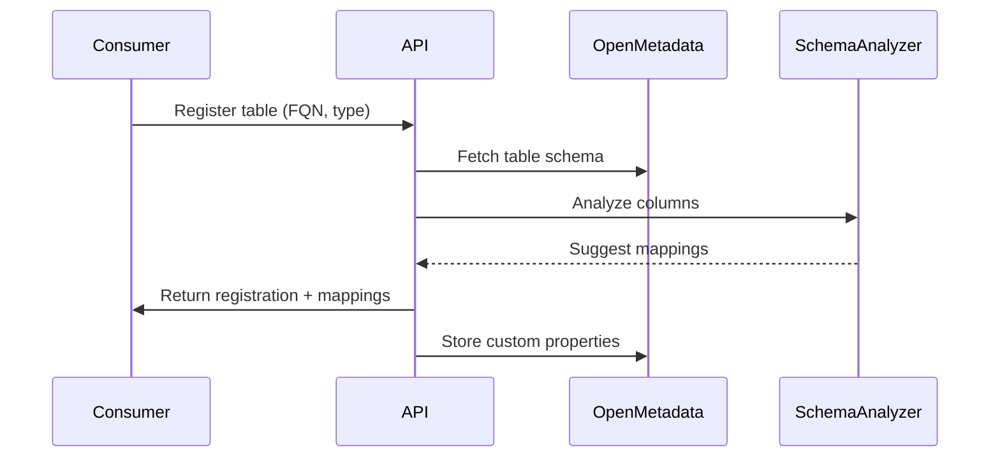
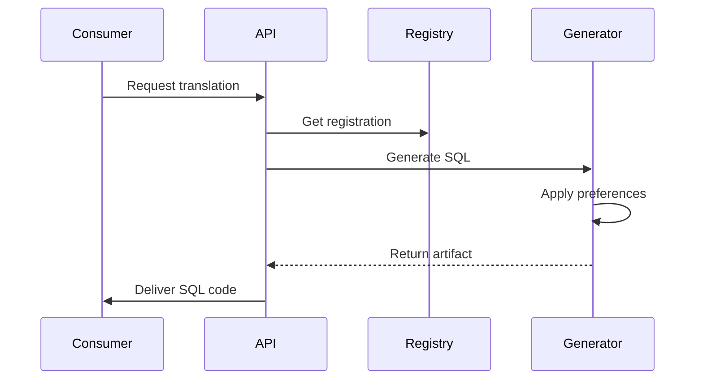
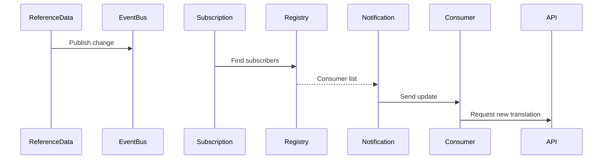

# Catalog Integration Service - Enhanced Design

## Overview

The enhanced catalog integration service addresses the requirement for downstream consumers to specify their table FQNs (Fully Qualified Names) and receive customized translation code. This design shifts from a tag-based discovery approach to a consumer-centric registration model.

## Problem Statement

Downstream systems have various naming conventions for reference data tables:
- Country codes: `rf_cntry`, `rf_ctry`, `country_code`, etc.
- Language codes: `lang_code`, `language_cd`, `iso_639`, etc.
- Organization codes: `org_code`, `company_id`, `entity_cd`, etc.

Each consumer needs:
1. To register their specific table FQNs
2. Custom column mappings to canonical reference data
3. Database-specific translation code (views, UDFs, tables)
4. Update notifications when reference data changes

## Architecture Components

### 1. Consumer Registration Service

**Purpose**: Manage consumer table registrations and mappings

**Key Features**:
- Register consumer tables with FQNs from OpenMetadata
- Map consumer columns to reference data fields
- Store preferences (view vs UDF vs mapping table)
- Track active subscriptions

**API Endpoints**:
```
POST   /api/v1/catalog-integration/registrations
GET    /api/v1/catalog-integration/registrations/consumer/{consumerId}
PUT    /api/v1/catalog-integration/registrations/{consumerId}/{tableFqn}/mapping
DELETE /api/v1/catalog-integration/registrations/{consumerId}/{tableFqn}
```

### 2. Schema Analyzer

**Purpose**: Analyze table schemas and suggest mappings

**Key Features**:
- Fetch schemas from OpenMetadata using FQNs
- Pattern matching for column name detection
- Auto-suggest field mappings
- Validate mapping configurations
- Calculate confidence scores

**Patterns Detected**:
- Country: `*country*code*`, `*cntry*`, `*ctry*`, `*iso*code*`
- Language: `*lang*code*`, `*language*`, `*iso_639*`
- Organization: `*org*code*`, `*company*`, `*entity*`
- Carrier: `*carrier*code*`, `*airline*`, `*scac*`

### 3. Translation Generator Service

**Purpose**: Generate database-specific translation code

**Supported Databases**:
- Oracle
- DB2
- PostgreSQL
- MySQL

**Translation Types**:
- **Views**: Simple joins with reference data
- **Materialized Views**: Cached joins for performance
- **UDFs**: Functions for inline translations
- **Mapping Tables**: Physical lookup tables
- **Stored Procedures**: Complex translation logic
- **CDC Streams**: Real-time change propagation

### 4. OpenMetadata Integration

**Custom Properties Stored**:
```json
{
  "reference_data_type": "country",
  "reference_data_consumer": "analytics_team",
  "translation_config": {...},
  "translation_preferences": {...},
  "registration_timestamp": "2025-08-10T10:00:00"
}
```

## Data Models

### ConsumerRegistration
```java
{
  consumerId: String
  tableFqn: String              // e.g., "snowflake.analyouytics.dim.rf_cntry"
  referenceDataType: Enum       // COUNTRY, LANGUAGE, ORGANIZATION, CARRIER, etc.
  mapping: TableMapping
  preferences: TranslationPreferences
  registeredAt: LocalDateTime
  active: Boolean
}
```

### TableMapping
```java
{
  columnMappings: Map<String, String>  // consumer_col -> ref_field
  keyColumn: String                     // join key column
  codeSystem: String                    // ISO3166-1, ISO639, etc.
  transformationRules: Map              // column transformations
  filterCondition: String               // WHERE clause
  joinType: Enum                        // INNER, LEFT, RIGHT
}
```

### TranslationPreferences
```java
{
  translationType: Enum         // VIEW, MATERIALIZED_VIEW, UDF, TABLE
  materialized: Boolean
  refreshStrategy: Enum         // ON_DEMAND, SCHEDULED, REAL_TIME
  includeHistorical: Boolean
  deliveryMethod: Enum          // PULL, PUSH, WEBHOOK
  databaseEngine: String
  namingConvention: Enum        // SNAKE_CASE, CAMEL_CASE, etc.
}
```

## Workflow

### 1. Registration Flow



### 2. Translation Generation Flow



### 3. Update Notification Flow



## Example Usage

### 1. Register a Consumer Table

**Request**:
```json
POST /api/v1/catalog-integration/registrations
{
  "consumer_id": "analytics_team",
  "table_fqn": "oracle.analytics_db.dim.rf_cntry",
  "reference_data_type": "COUNTRY",
  "mapping": {
    "column_mappings": {
      "cntry_cd": "country_code",
      "cntry_nm": "country_name",
      "iso2": "iso2_code",
      "iso3": "iso3_code"
    },
    "key_column": "cntry_cd",
    "code_system": "ISO3166-1"
  },
  "preferences": {
    "translation_type": "MATERIALIZED_VIEW",
    "refresh_strategy": "SCHEDULED",
    "refresh_interval_minutes": 60,
    "database_engine": "oracle"
  }
}
```

### 2. Generated Translation (PostgreSQL View)

```sql
-- Translation view for country reference data
-- Generated for table: postgres.app_db.public.country_codes
-- Generated at: 2025-08-10T10:00:00

CREATE OR REPLACE VIEW country_codes_country_trans AS
SELECT
    t.*,
    r.country_code AS ref_country_code,
    r.country_name AS ref_country_name,
    r.iso2_code AS ref_iso2_code,
    r.iso3_code AS ref_iso3_code,
    r.valid_from AS ref_valid_from,
    r.valid_to AS ref_valid_to,
    r.is_active AS ref_is_active
FROM public.country_codes t
LEFT JOIN reference_data.country_current r
    ON t.code = r.country_code
    AND r.code_system = 'ISO3166-1';

COMMENT ON VIEW country_codes_country_trans IS
    'Auto-generated translation view for country reference data';
```

### 3. Generated Translation (Oracle Function)

```sql
-- Oracle translation function
CREATE OR REPLACE FUNCTION translate_country(
    p_code VARCHAR2,
    p_field VARCHAR2 DEFAULT 'name'
) RETURN VARCHAR2 IS
    v_result VARCHAR2(4000);
BEGIN
    SELECT
        CASE p_field
            WHEN 'country_name' THEN country_name
            WHEN 'iso2_code' THEN iso2_code
            WHEN 'iso3_code' THEN iso3_code
            ELSE country_name
        END INTO v_result
    FROM reference_data.country_current
    WHERE country_code = p_code
        AND code_system = 'ISO3166-1'
        AND ROWNUM = 1;
    
    RETURN v_result;
EXCEPTION
    WHEN NO_DATA_FOUND THEN
        RETURN NULL;
END translate_country;
/
```

### 4. Generated Translation (DB2 View)

```sql
-- DB2 translation view for country
CREATE OR REPLACE VIEW COUNTRY_CODES_COUNTRY_TRANS AS
SELECT
    t.*,
    r.country_code AS ref_country_code,
    r.country_name AS ref_country_name,
    r.iso2_code AS ref_iso2_code,
    r.iso3_code AS ref_iso3_code,
    r.valid_from AS ref_valid_from,
    r.valid_to AS ref_valid_to,
    r.is_active AS ref_is_active
FROM PUBLIC.COUNTRY_CODES t
LEFT JOIN reference_data.country_current r
    ON t.code = r.country_code
    AND r.code_system = 'ISO3166-1';

COMMENT ON VIEW COUNTRY_CODES_COUNTRY_TRANS IS
    'Auto-generated translation view for country';
```

### 5. Generated Translation (MySQL View)

```sql
-- MySQL translation view for country
CREATE OR REPLACE VIEW country_codes_country_trans AS
SELECT
    t.*,
    r.country_code AS ref_country_code,
    r.country_name AS ref_country_name,
    r.iso2_code AS ref_iso2_code,
    r.iso3_code AS ref_iso3_code,
    r.valid_from AS ref_valid_from,
    r.valid_to AS ref_valid_to,
    r.is_active AS ref_is_active
FROM app_db.country_codes t
LEFT JOIN reference_data.country_current r
    ON t.code = r.country_code
    AND r.code_system = 'ISO3166-1';
```

## Benefits

1. **Consumer-Centric**: Each consumer registers their specific needs
2. **Auto-Discovery**: Schema analysis suggests mappings automatically
3. **Multi-Database**: Supports various database engines with optimized code
4. **Flexible Delivery**: Views, UDFs, tables, or API endpoints
5. **Version Control**: Track changes and maintain compatibility
6. **Performance Options**: Materialized views, caching, partitioning
7. **Update Management**: Automatic notifications on reference data changes

## Security Considerations

1. **Authentication**: OAuth2/OIDC for API access
2. **Authorization**: Role-based access to registrations
3. **Data Access**: Consumers only see their registered tables
4. **Audit Trail**: All registrations and changes logged
5. **Encryption**: TLS for transit, encryption at rest for sensitive mappings

## Performance Optimization

1. **Caching**: Cache table schemas and mappings
2. **Batch Processing**: Generate multiple translations in parallel
3. **Incremental Updates**: Only regenerate changed translations
4. **Connection Pooling**: Reuse OpenMetadata connections
5. **Async Processing**: Non-blocking reactive streams

## Monitoring & Observability

1. **Metrics**:
   - Registration count by consumer
   - Translation generation time
   - Mapping confidence scores
   - Update delivery success rate

2. **Logging**:
   - Registration events
   - Translation generation
   - Schema analysis results
   - Error conditions

3. **Alerts**:
   - Failed registrations
   - Low confidence mappings
   - Translation generation failures
   - Update delivery failures

## Future Enhancements

1. **ML-Based Mapping**: Use machine learning to improve mapping suggestions
2. **Data Quality Scores**: Assess translation quality and completeness
3. **Lineage Tracking**: Track data flow through translations
4. **Self-Service Portal**: Web UI for registration and management
5. **Template Library**: Pre-built translation templates
6. **Cross-Reference Support**: Handle many-to-many mappings
7. **Historical Translations**: Point-in-time translation views
8. **API Gateway**: REST endpoints for direct translation queries

## Migration Path

For existing catalog-based implementations:

1. **Inventory**: List all tables with reference data
2. **Analyze**: Run schema analyzer on each table
3. **Register**: Create registrations with mappings
4. **Generate**: Produce translation artifacts
5. **Deploy**: Replace existing views/functions
6. **Monitor**: Track usage and performance

## Conclusion

This enhanced catalog integration design provides a flexible, scalable solution for managing reference data translations across diverse downstream systems. By allowing consumers to register their specific table FQNs and preferences, we can generate optimized, database-specific translation code that meets their exact needs while maintaining consistency with the canonical reference data.